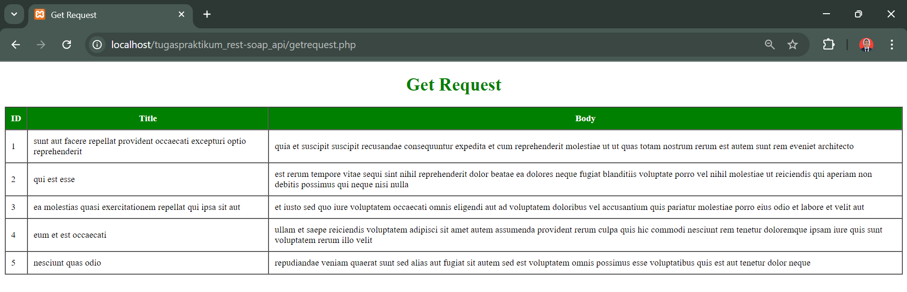
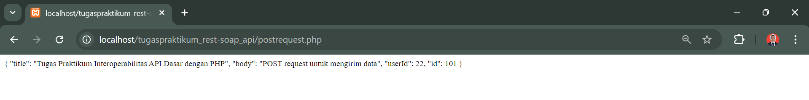
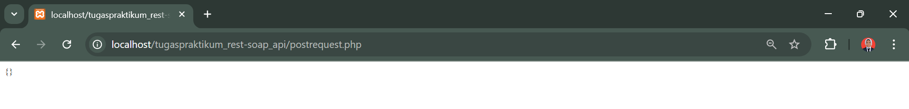

Tugas Praktikum Interoperability API Dasar dengan PHP

1. Hasil Konsumsi Data dengan GET Request, menampilkan 5 data pertama.
   

2. Hasil Mengirim Data dengan POST Request, mengganti isi body dengan data lain yang relevan (misalnya judul dan konten berbeda).
   

3. Hasil Menghapus Data dengan DELETE Request.
   

4. Analisis Metode HTTP.
   Perbedaaan antara metode GET, POST, dan DELETE.
   - GET digunakan untuk mengambil data dari server.
   - POST digunakan untuk mengirim data ke server untuk membuat resource baru.
   - DELETE digunakan untuk menghapus resource dari server.

   Diskusikan skenario kapan harus menggunakan masing-masing metode dalam aplikasi nyata. (jelaskan perbedaan get, post dan delete dan digunakannya kapan)
   - Dalam aplikasi nyata, menggunakan metode GET contohnya seperti pada saat menampilkan riwayat pesanan, menampilkan daftar produk, menampilkan profil pengguna dan lainnya.
   - Untuk metode POST, contoh penggunaannya dalam aplikasi nyata yaitu seperti membuat akun baru, menambahkan produk ke keranjang, mengirim pesan, mengunggah foto dan lainnya.
   - Untuk metode DELETE, contoh penggunaannya dalam aplikasi nyata yaitu seperti menghapus produk dari keranjang belanja, menghapus pesan, menghapus komentar dan lainnya.
